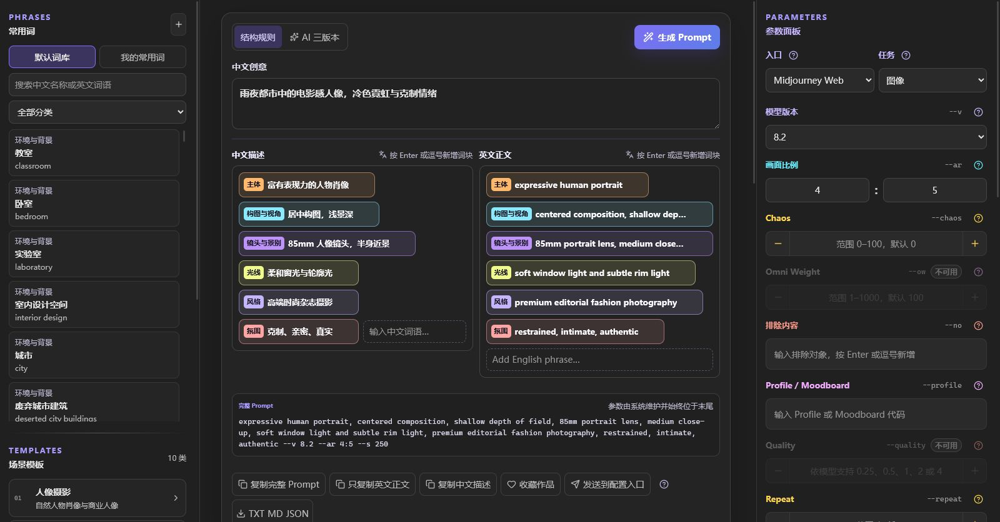

# Prompt Craft Studio

[English](README_EN.md) · [快速开始](docs/zh-CN/quick-start.md) · [配置手册](docs/zh-CN/configuration.md) · [使用手册](docs/zh-CN/user-guide.md) · [部署指南](docs/zh-CN/deployment.md) · [故障排查](docs/zh-CN/troubleshooting.md)

一个可自托管的中英双语 Midjourney Prompt 工作台。它把自然语言创意、结构化彩色词块、参数校验、图片引用、历史和作品库放在同一个响应式界面中。

> [!IMPORTANT]
> 本项目不是 Midjourney 官方产品，也不会直接创建 Midjourney 图片任务。“发送到配置入口”仅把文本推送到 Discord Webhook 或自定义 HTTP 接口。



## 功能概览

- 结构规则生成，或通过 AI 一次生成“简洁、详细、实验性”三个版本。
- 中英文彩色词块双向编辑；中文修改可逐块翻译，手动英文可锁定保护。
- 主体、动作、环境、构图、镜头、光线、色彩、材质、媒介、风格、氛围、排除内容等结构分组。
- 642 个只读默认词条、个人常用词、搜索筛选和跨分组拖放。
- 10 类场景模板和数据驱动的 Midjourney 参数面板。
- 按模型、Web/Discord、图像/视频自动禁用不兼容参数；不兼容参数不会进入最终 Prompt。
- 普通图片、Style Reference、Omni Reference 和视频帧 URL；Imagine、Describe、Blend、Video 指令助手。
- 每位用户最多 100 条去重历史；收藏、文件夹和不可变修订不设上限。
- TXT、Markdown、JSON 导出，以及批量删除。
- Better Auth 邮箱注册/验证/重置密码，PostgreSQL + Drizzle 持久化。
- 用户级 AI/翻译/文本推送配置；敏感凭据使用 AES-256-GCM 加密并仅返回掩码。
- Docker Compose 一键启动 PostgreSQL、迁移、应用和 Mailpit；可选 LibreTranslate。

## 最快启动方式

要求：Docker Engine 或 Docker Desktop（包含 Compose v2），建议至少 4 GB 可用内存。

```bash
git clone https://github.com/liaoth/prompt-craft-studio.git
cd prompt-craft-studio
cp .env.example .env
```

编辑 `.env`，至少替换：

- `POSTGRES_PASSWORD`
- `DOCKER_DATABASE_URL` 中对应的、经过 URL 编码的数据库密码
- `BETTER_AUTH_SECRET`
- `APP_ENCRYPTION_KEY`

生成两个随机密钥（每条命令执行一次）：

```bash
node -e "console.log(require('crypto').randomBytes(32).toString('base64'))"
```

启动：

```bash
docker compose up --build -d
docker compose ps
```

访问：

- 应用：<http://localhost:3000>
- 开发邮件：<http://localhost:8025>
- 健康检查：<http://localhost:3000/api/health>

首次注册后，到 Mailpit 打开验证邮件，再登录使用。即使不配置 AI 和翻译服务，结构规则模式也可以工作。完整步骤见[快速开始](docs/zh-CN/quick-start.md)。

## 配置导航

| 需求 | 去哪里配置 |
| --- | --- |
| PostgreSQL、账号密钥、SMTP、代理 | `.env`，见[配置手册](docs/zh-CN/configuration.md) |
| 站点共享 AI / Ollama | `.env` 中的 `SITE_AI_*` |
| 站点共享 LibreTranslate | `.env` 中的 `SHARED_LIBRETRANSLATE_*` |
| 用户自己的 AI / 翻译服务 | 登录后打开“服务配置” |
| Discord Webhook / 自定义 HTTP 推送 | 登录后打开“服务配置 → 文本推送入口” |
| 公网域名、HTTPS、反向代理 | [部署指南](docs/zh-CN/deployment.md) |

配置优先级：

1. 当前用户启用的 AI/翻译配置；
2. 管理员设置的站点共享服务；
3. 翻译不可用时保留原文并提示；AI 三版本不可用时明确报错，结构规则模式不受影响。

## 本地开发

要求：Node.js 22.13+、PostgreSQL 15+。

```bash
npm ci
npm run db:migrate
npm run dev
```

质量检查：

```bash
npm test
npm run typecheck
npm run lint
npm run build
```

## 技术栈

Next.js / Vinext、React、TypeScript、PostgreSQL、Drizzle ORM、Better Auth、Zod、Vitest、Docker Compose。

## 安全与数据

- 不要提交 `.env`、数据库备份或任何真实 API Key。
- 更换 `APP_ENCRYPTION_KEY` 会导致已保存的用户服务凭据无法解密。
- 自定义外部端点受 HTTPS、主机白名单、DNS 和私网地址检查保护。
- 生产迁移前先备份 PostgreSQL；数据库卷不会随普通 `docker compose down` 删除。
- 安全问题请查看 [SECURITY.md](SECURITY.md)。

## 许可

[MIT](LICENSE)。Midjourney 名称及商标归其各自权利人所有。
